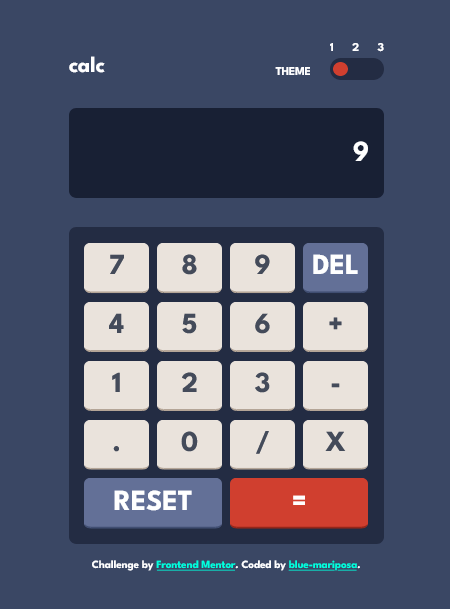

# Frontend Mentor - Calculator app solution

This is a solution to the [Calculator app challenge on Frontend Mentor](https://www.frontendmentor.io/challenges/calculator-app-9lteq5N29). Frontend Mentor challenges help you improve your coding skills by building realistic projects. 

## Table of contents

- [Overview](#overview)
  - [Screenshot](#screenshot)
  - [Links](#links)
- [My process](#my-process)
  - [Built with](#built-with)
  - [What I learned](#what-i-learned)
  - [Continued development](#continued-development)
  - [Useful resources](#useful-resources)
- [Author](#author)
- [Acknowledgments](#acknowledgments)

## Overview

This is a simple calculator with three state theme switch. On load, the app checks if a theme state has been saved in the browsers local storage and adjusts the theme accordingly. If not it uses the default theme. 
The calculator accepts keyboard input - only numbers, operators and some specil keys.
The app was created for mobile first hence not other media queries.

<!-- - **Bonus**: Have their initial theme preference checked using `prefers-color-scheme` and have any additional changes saved in the browser -->

### Screenshot





### Links

- Solution URL: [Add solution URL here](https://your-solution-url.com)
- Live Site URL: [Add live site URL here](https://your-live-site-url.com)

## My process
- Took notes of the requirements of the project and research needed.
- Wrote down the structure. [notes.md](./notes.md)
- Created my folder structure.
  - calculator
    - assets
      - js[](./assets/js/calculator.js)
      - css [](./assets/css/calculator.css)
      - images [](./assets/images/favicon-32x32.png)
      - screenshots [](./screenshots)
      - fonts [](./assets/fonts)
    - index.html [](./index.html)
    - readme.md [](./README.md)
- Created the html.
- Created the css.
  - Flexbox for center the entire app and header elements.
  - Imported the League-spartan font from google fonts.
  - Used Grid to layout key buttons.
  - No media queries
- Took screenshots.

### Built with

- Semantic HTML5 markup
- CSS
- Flexbox
- CSS Grid
- JavaScript
- Microsoft Edge
- VS-Code

### What I learned

- Ways of positioning content using css grid.
- how to manipulate text in the DOM using keyboard.

# Code i'm proud of
```html
<div class="themes">
        <p>theme</p>
        <div class="theme-switch">
            <input type="radio" name="theme" id="theme-one" checked>
            <label for="theme-one" class="radio-selector">1</label>
            <input type="radio" name="theme" id="theme-two">
            <label for="theme-two" class="radio-selector">2</label>
            <input type="radio" name="theme" id="theme-three">
            <label for="theme-three" class="radio-selector">3</label>
          <div class="theme-switch-bg">
            <div class="theme-switch-btn"></div>
          </div>
        </div>
      </div>
```

```js
function checkStoredTheme(){
    let localTheme = localStorage.getItem("calc-theme");
    if(localTheme){
        body.removeAttribute("class");
        body.classList.add(localTheme);
    }else{
        body.removeAttribute("class");
    }

    radioBtns.forEach((radioBtn) => {
        if(localTheme == radioBtn.id){
            radioBtn.setAttribute("checked", true);
        }
    })
}

```


### Continued development

- Add accessiblity features.
- best html elements to use fo a particular project.
- Optimize my css code and javascript code.
- Provide more concise comments in my code.

### Useful resources

- [Javscript references](https://www.javatpoint.com/javascript-setattribute#:~:text=JavaScript%20setAttribute%28%29%20The%20setAttribute%28%29%20method%20is%20used%20to,new%20attribute%20with%20the%20specified%20name%20and%20value.) - change attribute of HTML element.

## Author

- Frontend Mentor - [@blue-mariposa](https://www.frontendmentor.io/profile/blue-mariposa).

## Acknowledgments

- Thanks to Frontend Mentor for the guide(s) [Link](https://www.frontendmentor.io).
